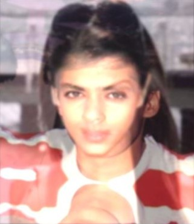

This is Project 1 for the course CS5670 : Introduction to Computer Vision taught by Prof. Noah Snavely. 
This project is submitted by Kopal Sharma (ks2446). 

The project required us to write image filtering function and use it to create hybrid images. 

I used the images of two bollywood celebrities from the 90's - Salman Khan and Aishwariya Rai. 
The dimension of both of the images was 260 x 300. 

The images are - 

The configurations of the hybrid image was - 

{

  "left_sigma": 1.7,

  "left_size": 6,

  "left_mode": "low",

  "right_sigma": 1.7,

  "right_size": 3,

  "right_mode": "low",

  "mixin_ratio": 0.5,

  "scale_factor": 1.4,

  "view_grayscale": 0,

  "save_grayscale": 0
  
}

The hybrid image is 

I used low pass for both the left and right images, as I wanted to retain as many features from 
both the faces as possible. 

Fun fact - They used to date back in the 90's and were the most good looking couple ever, tabloids often talked about
how good looking their kids would be. Their breakup was a major news back then.